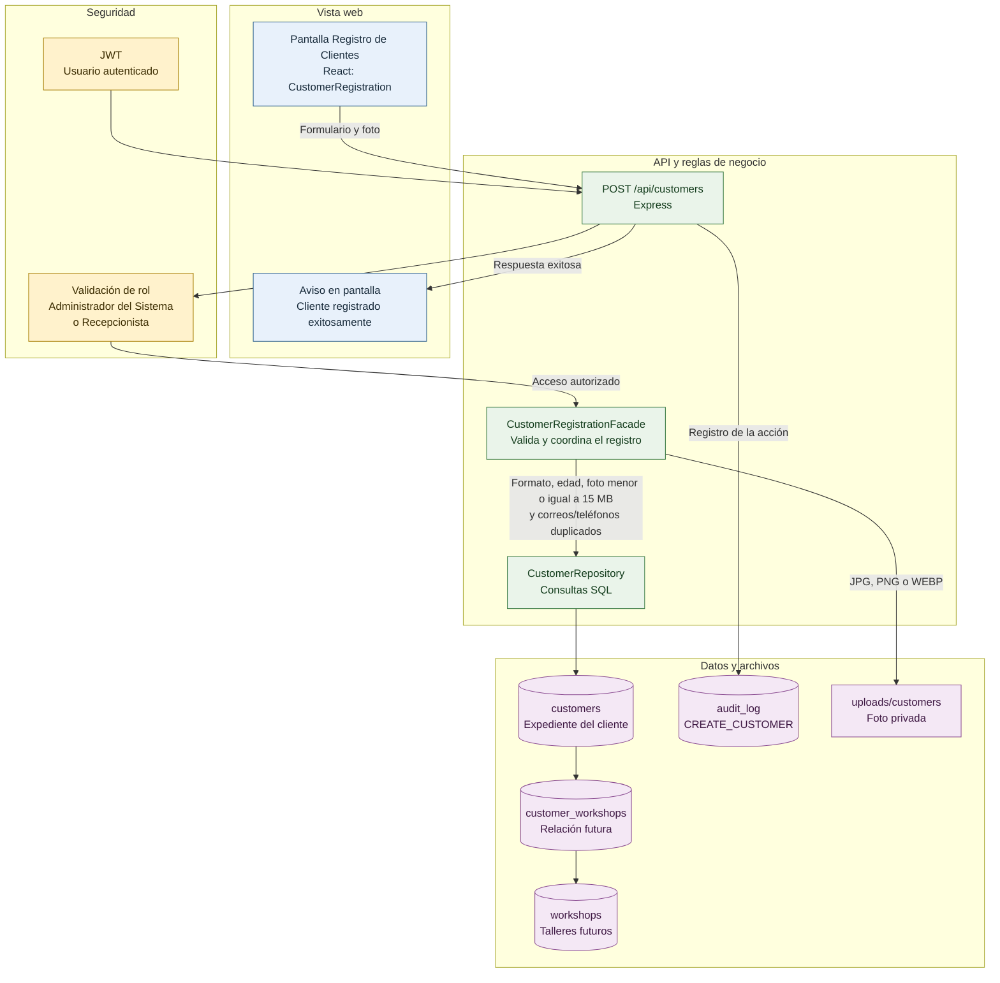

# Diagrama de Componentes: Registro de Clientes

Este diagrama describe el flujo completo del módulo, desde la pantalla que usa el personal autorizado hasta el almacenamiento de los datos y la fotografía.

## Cómo leerlo

1. La Recepcionista o el Administrador del Sistema captura los datos y la foto en la pantalla.
2. La API comprueba que la sesión esté activa y que el rol esté autorizado.
3. El Facade valida formatos, edad, duplicados y la foto antes de persistir nada.
4. El Repository guarda el expediente del cliente en MySQL; la foto queda fuera de la base de datos con nombre aleatorio.
5. La API registra la operación en la bitácora y devuelve el mensaje de éxito a la pantalla.
6. La relación `customer_workshops` deja preparada la asociación de un cliente con uno o varios talleres cuando se habilite esa función.

## Archivos relacionados

| Archivo | Responsabilidad |
| --- | --- |
| `frontend/src/main.jsx` | Pantalla, formulario y mensaje de éxito. |
| `backend/src/server.js` | Rutas HTTP, autenticación, roles, carga de foto y bitácora. |
| `backend/src/modules/customers/customerRegistrationFacade.js` | Validaciones y orquestación del registro. |
| `backend/src/modules/customers/customerRepository.js` | Persistencia de clientes y consulta de duplicados. |
| `database/schema.sql` | Tablas de clientes, talleres y relación multi-taller. |
