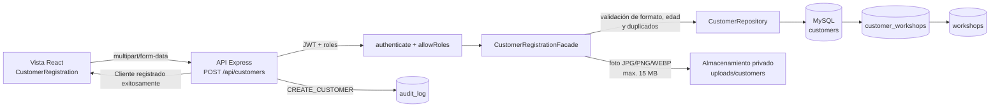

# Diagrama de Componentes: Registro de Clientes

La vista no contiene SQL ni reglas de duplicación. El Facade concentra la validación y la coordinación del registro; el Repository encapsula el acceso a MySQL. La tabla `customer_workshops` permite asociar uno o varios talleres sin modificar el expediente del cliente cuando esa operación se incorpore.
