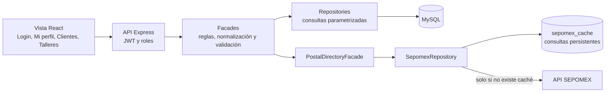
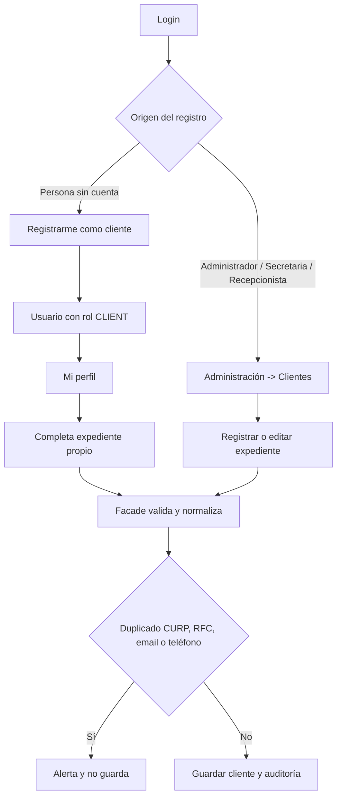
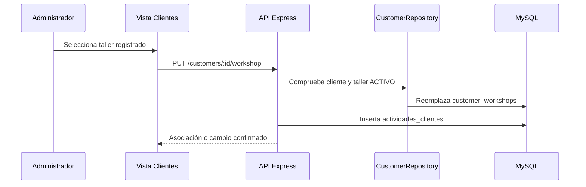
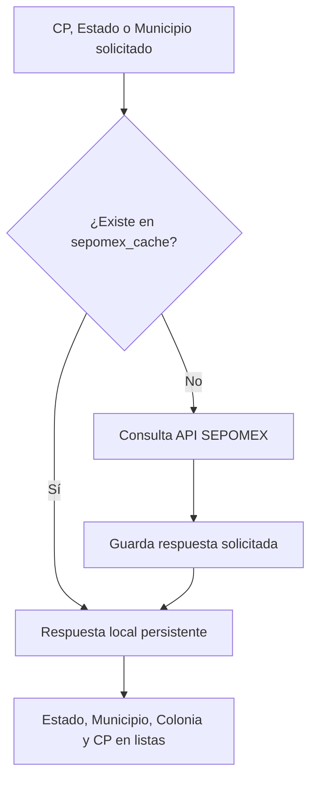

# Fase 3: Diagrama de Administración de Clientes y Talleres

Este documento describe el funcionamiento implementado en la Fase 3 y complementa la especificación funcional existente. El flujo respeta la arquitectura `Vista -> API -> Facade -> Repository -> MySQL`.

## Diagrama de componentes

## Flujo de Clientes

## Roles y permisos

| Rol | Acciones permitidas |
| --- | --- |
| Administrador del Sistema | Consulta todos los clientes, registra, edita, asocia/cambia taller, suspende/activa clientes y administra Talleres. |
| Secretaria / Recepcionista | Registra clientes y consulta los asociados a sus talleres. |
| Cliente | Se autorregistra, inicia sesión y consulta/modifica solamente `Mi perfil`. |

El menú limita las opciones visibles y el backend aplica de nuevo la regla con JWT, `authenticate` y `allowRoles`. Un Cliente recibe acceso denegado a listados de Clientes, Talleres y acciones administrativas.

## Asociación Cliente -> Taller

`customer_workshops` mantiene la relación del cliente y `user_workshops` limita la consulta para Secretaria y Recepcionista. No se permite capturar manualmente el nombre del taller.

## Integración SEPOMEX sin dependencia permanente de Internet

Se persisten únicamente las consultas realizadas: estados, municipios consultados, códigos postales y combinaciones Estado/Municipio utilizadas. No se descarga ni se replica todo el catálogo nacional. Cuando una dirección ya fue consultada, la aplicación la obtiene de `sepomex_cache` aunque no haya Internet. Una consulta nunca almacenada aún requiere conectividad inicial.

## Paginación

Clientes y Talleres reciben `page`, `limit`, búsqueda, estatus, orden y, para Clientes, filtro de taller. Los repositories ejecutan `LIMIT` y `OFFSET`; el límite se restringe a diez registros. La vista no descarga listas completas para dividirlas localmente.

## Validaciones y normalización

- CURP y RFC mexicanos, emails, teléfonos, fechas y campos obligatorios se validan en frontend y backend.
- La edad se calcula desde la fecha de nacimiento.
- CURP, RFC, nombres, direcciones, localidad, contactos, razón social y nombre de taller se normalizan a MAYÚSCULAS antes de guardar o detectar duplicados.
- El correo conserva las mayúsculas/minúsculas capturadas y solo elimina espacios externos.
- Las contraseñas no se normalizan: se validan y se guardan con hash bcrypt.
- Fotografías: JPG, PNG o WEBP, nombre UUID seguro y límite configurable. `MAX_TALLER_IMAGE_SIZE` representa los 15 GB solicitados para Talleres.

## Tablas de Fase 3

| Tabla | Uso |
| --- | --- |
| `customers` | Expediente, estatus y relación opcional con usuario Cliente. |
| `workshops` | Taller, datos fiscales, dirección, fotografía y estatus. |
| `customer_workshops` | Asociación Cliente -> Taller. |
| `user_workshops` | Alcance de Secretaria/Recepcionista por taller. |
| `actividades_clientes` | Auditoría funcional de la Fase 3. |
| `sepomex_cache` | Caché persistente de consultas SEPOMEX ya realizadas. |

### Tabla de actividades

`actividades_clientes` registra `id`, `usuario_id`, `cliente_id`, `taller_id`, `accion`, `descripcion` y `fecha_hora`. Las acciones incluyen: `CLIENTE_CREADO`, `CLIENTE_EDITADO`, `CLIENTE_SUSPENDIDO`, `CLIENTE_ACTIVADO`, `CLIENTE_ASOCIADO_TALLER`, `CLIENTE_CAMBIO_TALLER`, `TALLER_CREADO`, `TALLER_EDITADO`, `TALLER_SUSPENDIDO` y `TALLER_ACTIVADO`.

## Endpoints agregados o modificados

| Método | Endpoint | Descripción |
| --- | --- | --- |
| POST | `/api/auth/client-register` | Autorregistro, crea exclusivamente rol `CLIENT`. |
| GET/POST/PUT | `/api/customers/me` | Consulta, crea o actualiza el perfil propio del Cliente. |
| GET/POST | `/api/customers` | Consulta paginada y registro por personal autorizado. |
| PUT | `/api/customers/:id` | Edición administrativa de cliente. |
| PATCH | `/api/customers/:id/status` | Suspende o activa un cliente. |
| PUT | `/api/customers/:id/workshop` | Asocia o cambia el taller. |
| GET | `/api/workshops/options` | Talleres activos para asociación. |
| GET/POST | `/api/workshops` | Consulta paginada y alta de Talleres. |
| PUT/PATCH | `/api/workshops/:id` y `/api/workshops/:id/status` | Edición y estatus de Talleres. |
| GET | `/api/postal/*` | Estados, municipios, colonias y CP con caché persistente. |

## Archivos principales

- `backend/src/modules/postal/sepomexRepository.js`
- `backend/src/modules/postal/postalDirectoryFacade.js`
- `backend/src/server.js`
- `database/migrations/20261006_sepomex_persistent_cache.sql`
- `database/schema.sql`
- `frontend/src/main.jsx`
